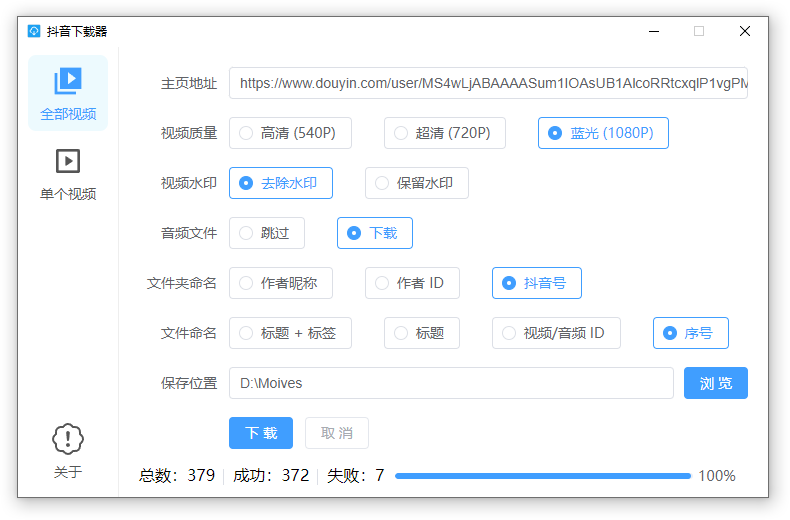
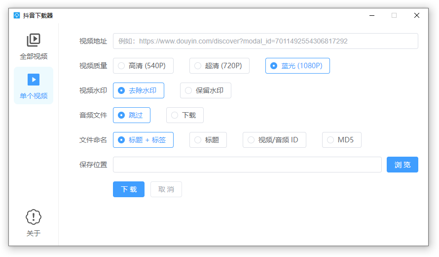
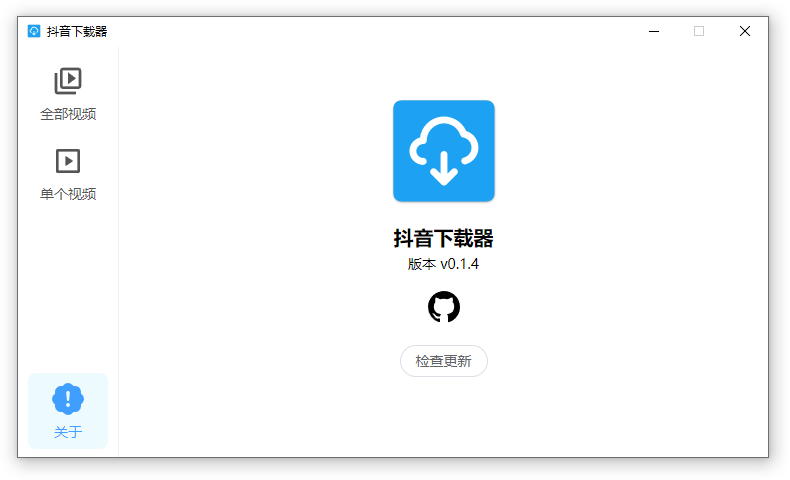

<h1 align="center">
  
   
  Douyin Downloader
   
</h1>

<h3 align="center">
A cross-platform download douyin video tool built with <a href="https://github.com/tauri-apps/tauri">tauri</a>.
</h3>

## Screenshots

## Install

Download from [release](https://github.com/lzdyes/douyin-downloader/releases). Supports Windows x64, Linux x86_64 and macOS 10.13+.

Or you can build it yourself. Supports Windows, Linux and macOS 10.13+.

Notes: If you could not start the app on Windows, please check that you have [Webview2](https://developer.microsoft.com/en-us/microsoft-edge/webview2/#download-section) installed.
